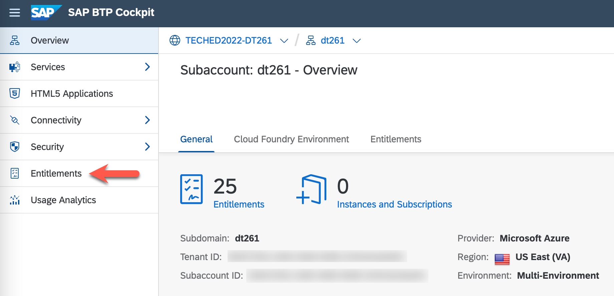
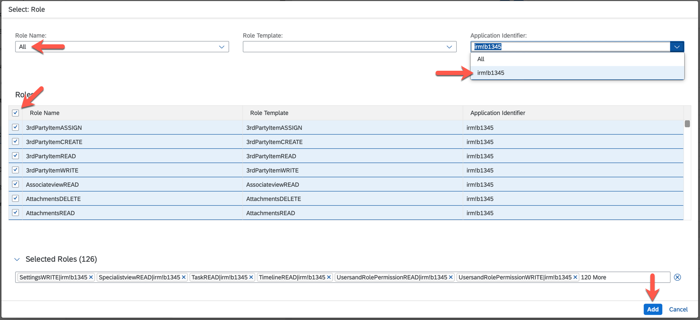
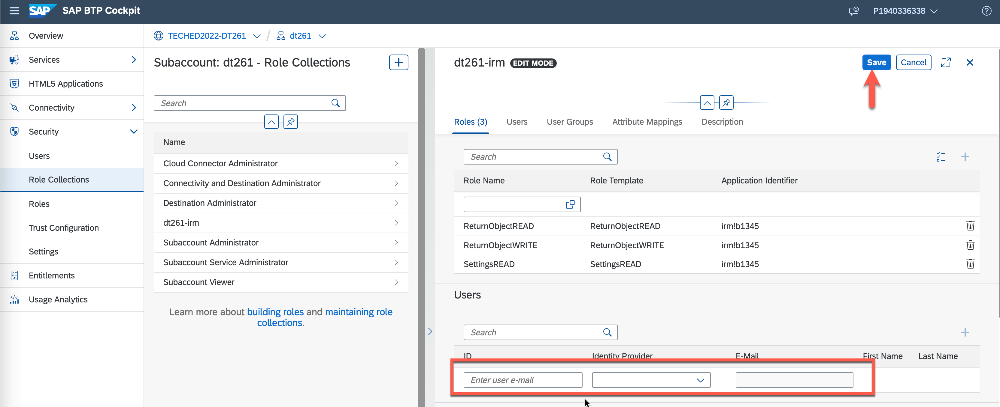

# Enable the SAP Intelligent Returns Management solution

In this exercise, you will enable and configure usage of the SAP Intelligent Returns Management Industry Cloud solution.

## Login to SAP Business Technology Platform (BTP) Global Account

1. Log in to the SAP BTP cockpit:
   - Open [https://cockpit.**us21**.hana.ondemand.com/cockpit/](https://cockpit.us21.hana.ondemand.com/cockpit/#).

      > **Note:** You can exchange the ***us21*** from the URL with another region in case you are not based in the USA.

   - Provide your username and password and press ***Log On***.
      
      > **Note:** During your TechEd hands-on, you will be provided with a predefined username and password.

      

2. Select your desired Global Account (if you have multiple ones) and click on ***Continue***.

      

## Create your Subaccount and assign entitlements for SAP Intelligent Returns Management (IRM)

In order to enable SAP IRM, you need to create a Subaccount in one of the supported regions and assign IRM entitlements to it.

1. Create a Subaccount in the desired region:
    > **Note:** You will be provided with a pre-created Subaccount for the on-site TechEd hands-on workshop, so you do not have to execute this step. Please ask your instructors for more details.

    - Click on **_Create_** > ***Subaccount***.

      
   
    - Set values for:
      - *Display Name*. Example: ***`dt261`***,
      - *Subdomain*. Example: ***`dt261`***, 
      - *Region*. Example: ***`Microsoft Azure US East (VA) cf-us21`***, 

        > **Note:** You need to choose a region in which SAP IRM is available. For more information on where SAP IRM is available, please visit the [official documentation](https://help.sap.com/docs/returns?locale=en-US).
     
      - and click ***Create***.

        

2. Add entitlements for SAP IRM to your Subaccount:

   - Click on the Subaccount you created in the previous step and navigate to ***Entitlements*** in the navigation menu. Then, click on ***Configure Entitlements***.
      > **Note:** You have to select the pre-created Subaccount for the on-site TechEd hands-on workshop. Please ask your instructors for more details.
      
      
      
      

   - Click on ***Add Service Plans*** and search for ***`SAP Intelligent Returns Management`*** in the ***Search*** field. Select the entitlement from the list and check ***`data-ingestion`*** and ***`application (Application)`*** plans from the ***Available Plans*** list. Click ***Add 2 Service Plans***.
      
      
      

   - Click ***Save*** on the Entitlements view.
      > **Note:** Do not forget or skip this step as the entitlements will not be saved, and you cannot continue with the next exercises. 
      
      

## Subscribe to SAP Intelligent Returns Management (IRM) and configure access to it

In order to be able to use the SAP IRM capabilities, you need to enable the IRM application and configure access to it.

1. Subscribe to the SAP IRM application.

   - From the navigation menu, navigate to ***Services*** > ***Instances and Subscriptions***. Click on ***Create***.

      

   - In the ***New Instance or Subscription*** pop-up, select:
     - ***`SAP Intelligent Returns Management`*** for *Service*,
     - ***`application`*** for *Plan*,
     - Click on ***Create***.

        

   > You should now have successfully subscribed to the SAP Intelligent Returns Management application.

      

2. Create a Role Collection, add Roles to it, and assign it to your user.
   - From the navigation menu, navigate to ***Security*** > ***Role Collections***. Click on the ***`+`*** button in the top-right corner of the screen.

      
  
   - Set a name for the Role Collection (e.g. ***`dt261-irm`***) and click ***Create***.

      
   
   - Click on the created Role Collection and click ***Edit*** from the detail view.

      

   - Click on the popup button in the ***Role Name*** field.

      

   - In the ***Select: Role*** view:
     - Select ***`All`*** for ***Role Name***
     - Select ***`irm!*****`*** for ***Application Identifier***, 
     - Check the checkboxes for ***`ReturnObjectREAD`***, ***`ReturnObjectWRITE`***, and ***`SettingsREAD`*** Roles,
     - Click the ***Add*** button.

      
   
   - Now, add your user to the Role Collection by entering your user id in the ***ID*** field as shown on the screenshot. Click on your user from the value help. Then, click the ***Save*** button.

      > **Note:** You have to use the pre-created user for the on-site TechEd hands-on workshop. Please ask your instructors for more details.  

      

After completing these steps, you will have enabled the SAP Intelligent Returns Management solution and have access to its application.

## Next Steps

Now that you have enabled SAP Intelligent Returns Management, you need to enable data integration from SAP S/4HANA via Data Ingestion for Industry Cloud.

### Go back to: [**Overview**](../../README.md) or Continue to: [**Enable data integration via Data Ingestion for Industry Cloud**](../ex1/README.md)
