# Enable Data Ingestion for Industry Cloud Solutions.

In this exercise, you will enable Data Ingestion for Industry Cloud solutions (DI). It is used as an integration point to SAP S/4HANA.

## Assign entitlements for Data Ingestion for Industry Cloud Solutions.

> **Note**
> During your TechEd Hands-On, you will be provided with a Subaccount with pre-assigned entitlements. You can skip this section.

In order to enable DI, you need to have entitlements assigned to your Subaccount.

1. Add entitlements for DI to your Subaccount:

   - In your Subaccount, navigate to  ***Entitlements*** in the navigation menu, then click on ***Configure Entitlements***.
            
      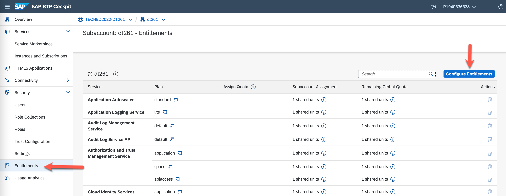

   - Click on ***Add Service Plans***, search for ***`Data Ingestion`*** in the ***Search*** field. Select the entitlement from the list and check ***`application (Application)`*** and ***`default`*** plans from the ***Available Plans*** list. Click ***Add 2 Service Plans***.
      
      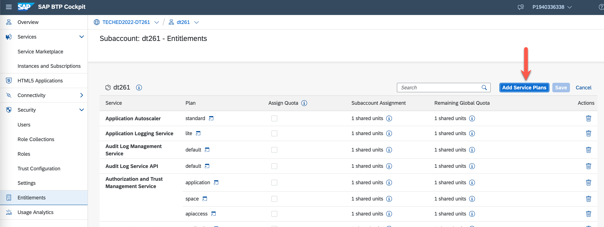
      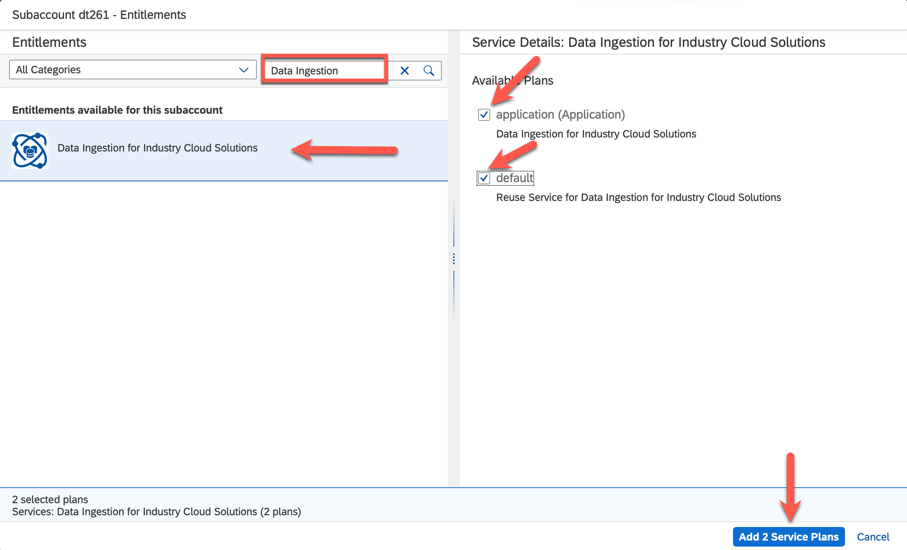

   - Click ***Save*** on the Entitlements view.
      > **Note**
      > Do not forget or skip this step as the entitlements will not be saved, and you cannot continue with the next exercises. 
      
      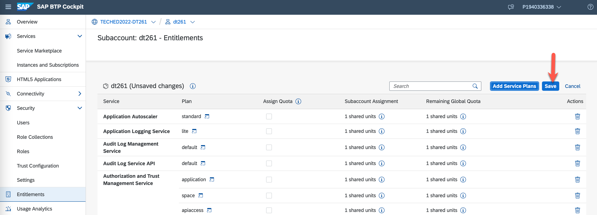

## Subscribe to Data Ingestion (DI) for Industry Cloud Solutions application.
In order to use the DI application, you need to subscribe to it and assign required roles to your user.

1. Subscribe to the DI application.

   - From the navigation menu, navigate to ***Services*** > ***Instances and Subscriptions***. Click on ***Create***.

      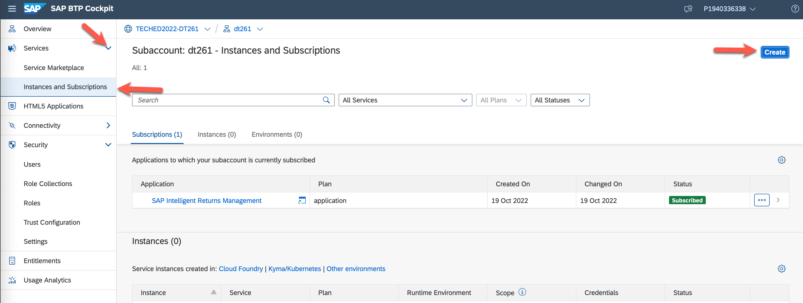

   - In the ***New Instance or Subscription*** pop-up, select:
     - ***`Data Ingestion for Industry Cloud Solutions`*** for *Service*,
     - ***`application`*** for *Plan*,
     - Click on ***Create***.

        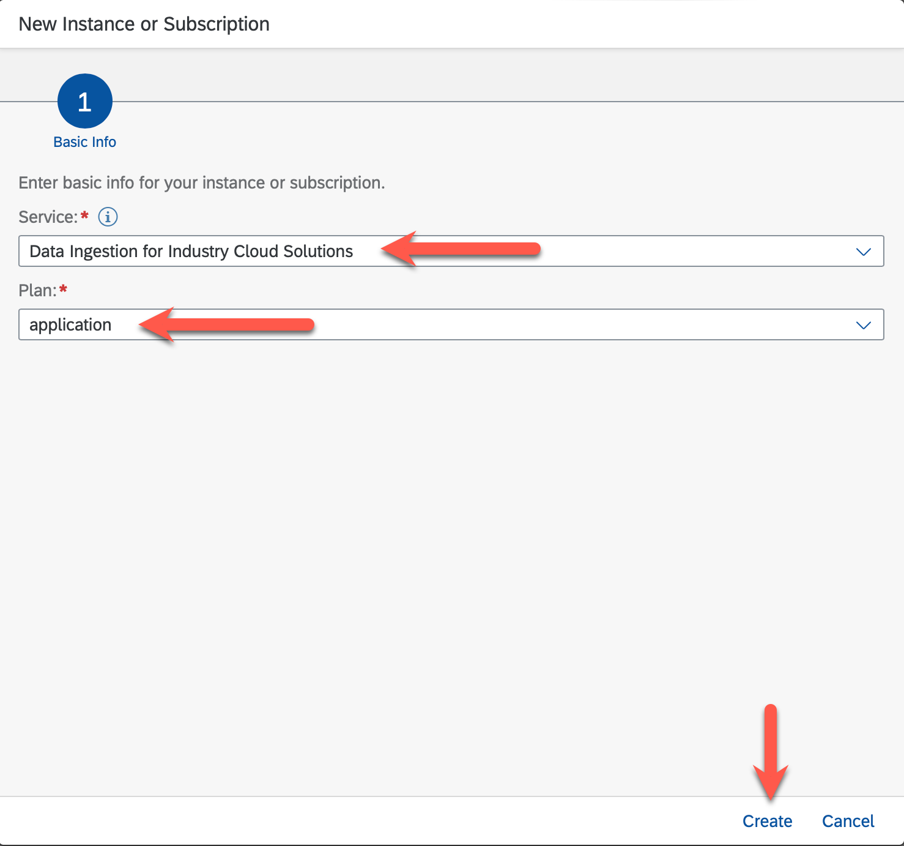

   > You should now have successfully subscribed to Data Ingestion for Industry Cloud Solutions application.

      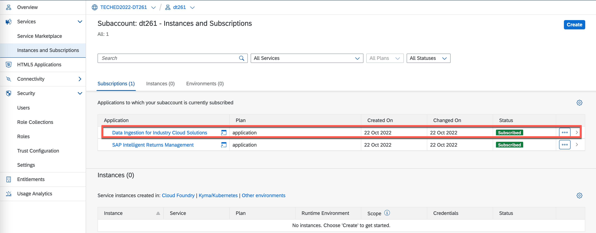

2. Create a Role Collection, add Roles to it, and assign it to your user.
   - From the navigation menu, navigate to ***Security*** > ***Role Collections***. Click on the ***`+`*** button in the top-right corner of the screen.

      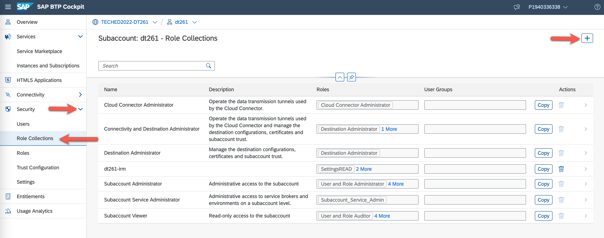
  
   - Set a name for the Role Collection (e.g. ***`dt261-di`***) and click ***Create***.

      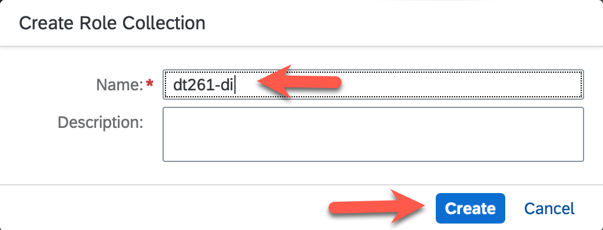
   
   - Click on the created Role Collection and click ***Edit*** from the detail view.

      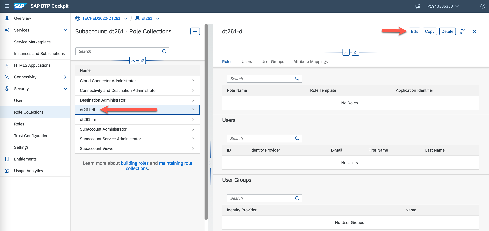

   - Click on the popup button in the ***Role Name*** field.

      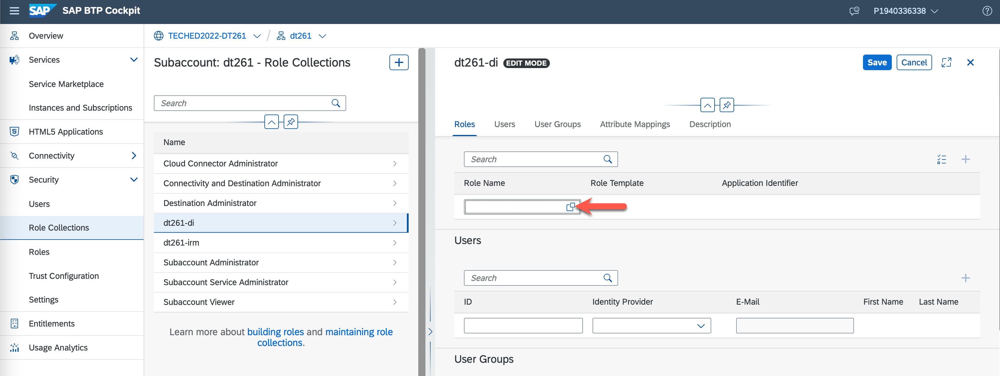

   - In the ***Select: Role*** view:
     - Select ***`All`*** for ***Role Name***,
     - Select ***`di4cic!*****`*** for ***Application Identifier***, 
     - Check the checkboxes for ***`integration-settingsREAD`***, ***`integration-settingsWRITE`***, ***`UsersandRolePermissionREAD`***, and ***`UsersandRolePermissionWRITE`*** Roles,
     - Click the ***Add*** button.

      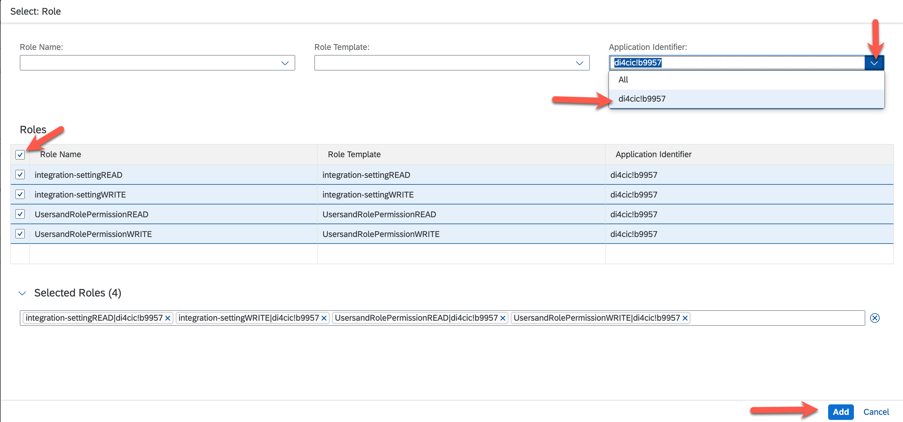
   
   - Now add your user to the Role Collection by entering your user id in the ***ID*** field as shown on the screenshot. Click on your user from the value help. Then, click the ***Save*** button.

      > **Note**
      > You have to use the pre-created user for the on-site TechEd hands-on workshop. Please ask your instructors for more details.  

      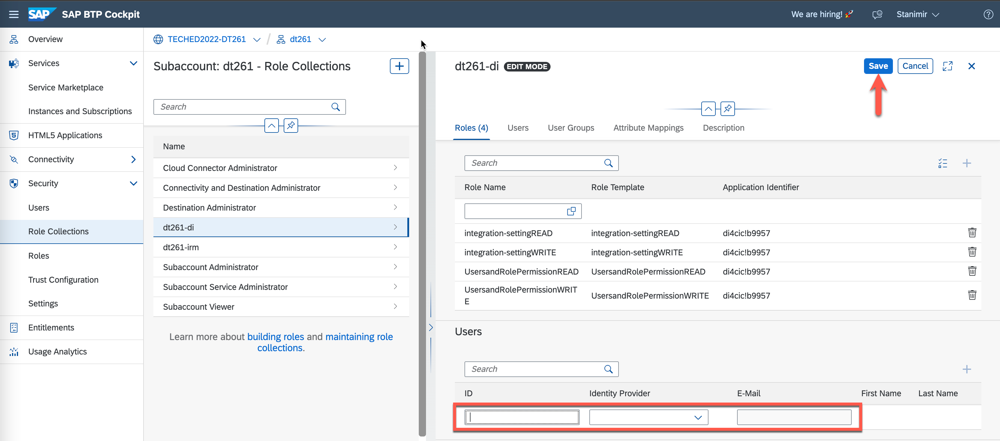

## Enable access to Data Ingestion (DI) for Industry Cloud Solutions APIs.
In order to enable integration to SAP S/4HANA, you need to create credentials for the DI APIs.

1. Create a service instance of DI.

   - From the navigation menu, navigate to ***Services*** > ***Instances and Subscriptions***. Click on ***Create***.

      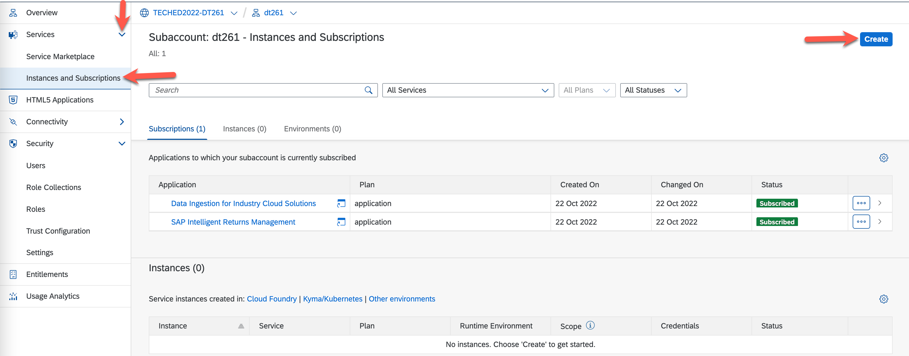

   - In the ***New Instance or Subscription*** pop-up, select:
     - ***`Data Ingestion for Industry Cloud Solutions`*** for *Service*,
     - ***`default`*** for *Plan*,
     - ***`Other`*** for *Runtime Environment*,
     - Set name for the *Instance Name* - e.g. ***`di`***,
     - Click on ***Create***.

        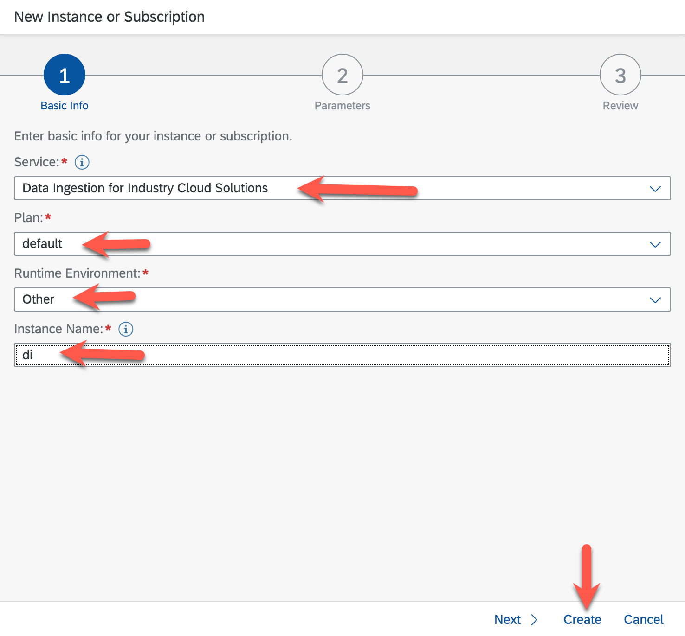

2. Create a service binding for the created service instance.

   - In the ***Instance and Subscriptions*** view, find the DI instance created in the previous step. Click on ***`...`*** (*Actions*) button and select ***Create Service Bindings***.

      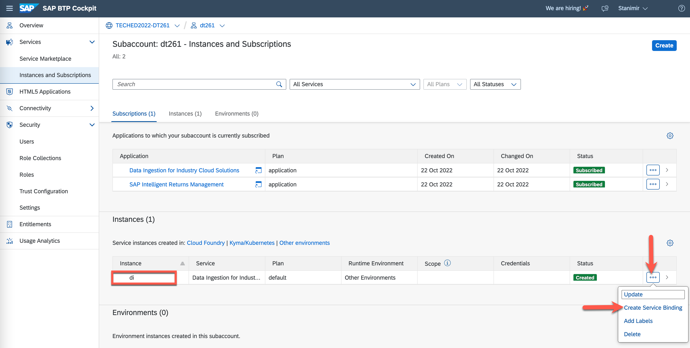

   - In the *New Binding* pop-up:
       - set the name for *Binding Name* - e.g. ***`di`***, 
       - click ***Create***.
         
         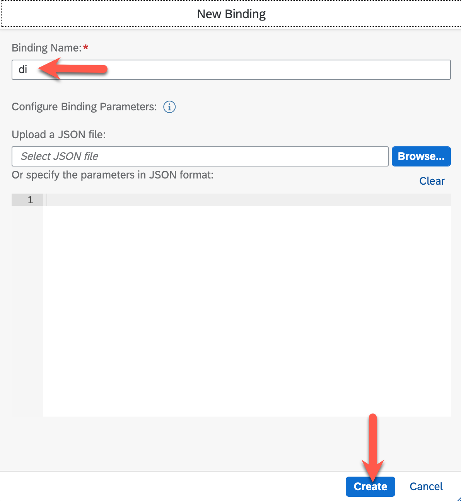

3. Download Credentials for the DI APIs:
   
   - In the ***Instance and Subscriptions*** view, find the DI instance created. Click on the ***1 service binding*** link in *Credentials* column.
      
      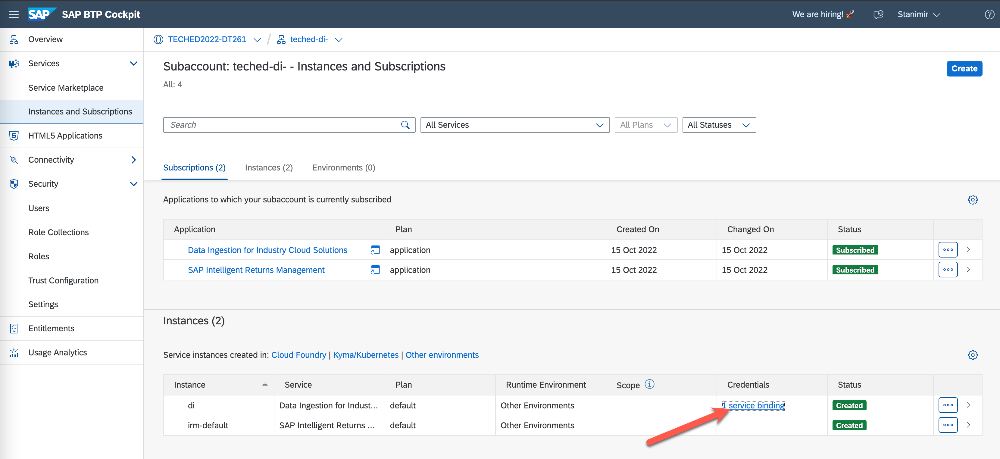
   
   - In the ***Credentials*** view, click on ***Download*** and save the file locally.
      
      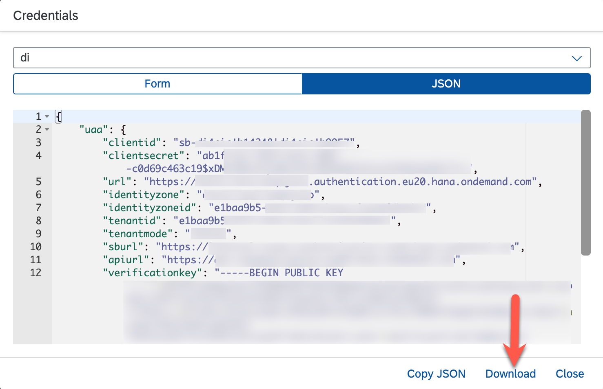
   
   > **Note**
   > These credentials will be needed in the next exercise in order to configure the integration from SAP S/4HANA to DI.

## Configure content of DI .
[//]: # (TODO)

After completing these steps you have enabled Data Ingestion for Industry Cloud Solutions and have access to its application and APIs.

## Next Steps

Now that you have enabled Data Ingestion for Industry Cloud Solutions, you need to configure it.

### Go back to: [**Enable SAP Intelligent Returns Management solution**](../ex0/README.md) or Continue to: [**Configure Data Ingestion for Industry Cloud Solutions**](../ex2/README.md)