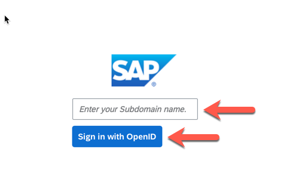
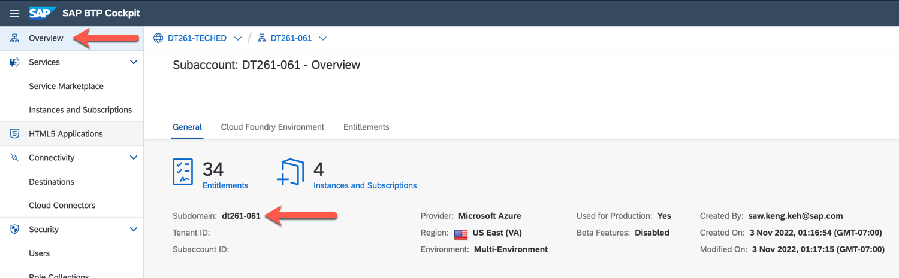

# Configure the Data Ingestion Application - Systems and Entities

In this exercise, you will configure the source systems (S/4HANA Business System) as well as the entities to be replicated.

> **Warning**
> The content of this exercise is up-to-date as of the SAP TechEd Hands-On Lab 2022. Please go to the official [SAP Data Ingestion for Industry Cloud documentation](https://help.sap.com/docs/DI_ICS/925366f331c54ee88e2b61ddae0be9fc/88da41cc955e49f1b7080e882bae36d4.html?locale=en-US) for the most recent version.

## Maintain Business System and Entities

1. Open the Data Ingestion Application:

   - To start you will launch the Data Ingestion for Industry Cloud Solutions application from your Subaccount. 

      

   - Enter your *Subdomain name* and click ***Sign in with OpenID***. Lowercase your subdomain name before entering (e.g. ***`DT261-000`*** becomes ***`dt261-000`***).

      

      > **Note**
      > You can find the subdomain name on the *Overview* page of your Subaccount.
         

2. Maintain a new Business System:

   - Go to the ***Systems*** page.

      

   - Click the ***Add*** button.

       

   - Set the *System Name* to `S4HANAHE4` and click the ***Add*** button.

       

       > **Note**
       > The system name `S4HANAHE4` is specified in the source system System Landscape Directory (SLD). It typically contains a client number so that one Data Ingestion tenant can receive data from 2 clients of the same source system.

      
3. Assign the Business System to the `Product` Object:

   - Go to the ***Data Entities*** page. 

       

   - Select the ***Edit*** (*Pencil*) button of the `Product` Data Entity. 

       

   - In the *Edit* dialog, select the Business System from before as ***Source System ID***. 
   - In the ***Edit*** dialog:
     - Select the Business System from before as ***Source System ID***,
     - Click the ***Save*** button.

      

   - The line with Product should look like this: 

        

      

      > **Note**
      > It can be required to edit the entity twice, the Process Status needs to be `Activated`.

4. Assign the Business System to other Data Objects:

    - Repeat step 2 and assign the Business System to the other data objects listed below:
      - Country Codes
      - Currency Codes
      - Customer Order
      - Distribution Channel Codes
      - Language Codes
      - MerchandiseCategoryHierarchyNode
      - Plant
      - Business Partner
      - Sales Organization
      - UnitOfMeasureCodes

5. Activate all Data Objects:

    - In the ***Data Objects*** tab:
      - Check the checkbox to select all Data Objects,
      - Click the ***Activate*** button,
	
      
       
      - Confirm the activation by clicking the ***Activate*** button.
      
      

## Next Steps

Now that you have configured Data Ingestion for Industry Cloud Solutions, you need to integrate it to SAP S/4HANA.

### Go back to: [**Enable Data Ingestion for Industry Cloud Solutions**](../ex1/README.md) or Continue to: [**Create an OAuth client**](../ex4/README.md)