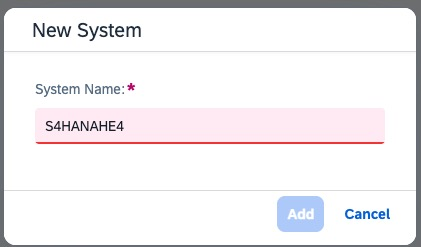
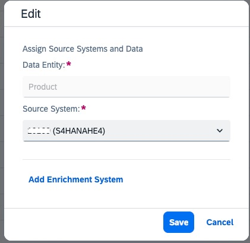

# Configure the Data Ingestion Application - Systems and Entities

In this exercise, you will configure the source systems (S/4HANA Business System) as well as the entities to be replicated.

## Maintain Business System and Entities

To start you will launch the Data Ingestion for Industry Cloud Solutions from your Subaccount. 

1. Maintain a new Business System:

   - Go to the ***System Information*** tab.

      

   - Click the ***Add*** button.

       

   - Set the *System Name* `S4HANAHE4` and click the ***Add*** button.

       

       > **Note**
       > The system name `S4HANAHE4` is specified in the source system System Landscape Directory (SLD). It typically contains a client number so that one Data Ingestion tenant can receive data from 2 clients of the same source system.

      
2. Assign the Business System to the `Product` Object:

   - Go to ***Data Ingestion*** tab. 

       

   - Select the ***Edit*** (*Pencil*) button of the `Product` Data Object. 

       

   - In the *Edit* dialog, select the Business System from before as ***Source System ID***. 
   - In the ***Edit*** dialog:
     - Select the Business System from before as ***Source System ID***,
     - Click the ***Save*** button.

      

   - The line with Product should look like this: 

         

       

      > **Note**
      > It can be required to edit the entity twice, the Process Status needs to be `Activated`.

3. Assign the Business System to other Data Objects:

    - Repeat step 2 and assign the Business System to the other data objects listed below:
      - Country Codes
      - Currency Codes
      - Customer Order
      - Distribution Channel Codes
      - Language Codes
      - MerchandiseCategoryHierarchyNode
      - Plant
      - Business Partner
      - Sales Organization
      - UnitOfMeasureCodes

4. Activate all Data Objects:

    - In the ***Data Objects*** tab:
      - Check the checkbox to select all Data Objects,
      - Click the ***Activate*** button,
	
      
       
      - Confirm the activation by clicking the ***Activate*** button.
      
      

## Next Steps

Now that you have configured Data Ingestion for Industry Cloud Solutions, you need to integrate it to SAP S/4HANA.

### Go back to: [**Enable Data Ingestion for Industry Cloud Solutions**](../ex1/README.md) or Continue to: [**Create an OAuth client**](../ex4/README.md)