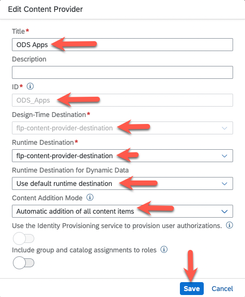
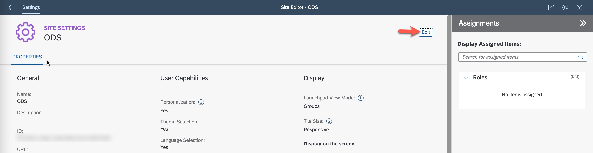
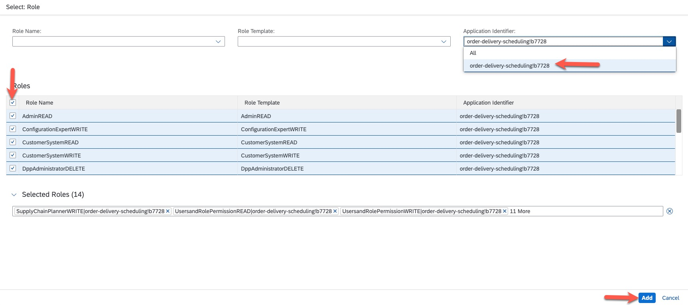

# Enable the SAP Order and Delivery Scheduling solution

In this exercise, you will enable and configure the usage of SAP Order and Delivery Scheduling Industry Cloud solution.

## Assign entitlements for the SAP Order and Delivery Scheduling (ODS) Industry Cloud solution

> **Note**
> During your TechEd Hands-On, you will be provided with a Subaccount with pre-assigned entitlements. You can skip this section.

In order to enable ODS you need to have entitlements assigned to your Subaccount.

1. Add entitlement for ODS to your Subaccount:

   - In your Subaccount, navigate to  ***Entitlements*** in the navigation menu and then click on ***Configure Entitlements***.
            
      

   - Click on ***Add Service Plans***, search for ***`SAP Order and Delivery Scheduling`*** in the ***Search*** field. Select the entitlement from the list and check ***`default`*** and ***`application (Application)`*** plans from the ***Available Plans*** list. 
      
      
      
   
   - Now, search for ***`Launchpad Service`*** in the ***Search*** field. Select the entitlement from the list and check ***`standard (Application)`*** plan from the ***Available Plans*** list. Click ***Add 3 Service Plans***. 
      
       

   - Click ***Save*** on the Entitlements view.
      > **Note**
      > Do not forget or skip this step as the entitlements will not be saved, and you cannot continue with next exercises. 
      
      

## Enable SAP Order and Delivery Scheduling and configure access to it

In order to be able to use the ODS capabilities, you need to enable the ODS application and APIs.

1. Subscribe to the ODS application.

   - From the navigation menu, navigate to ***Services*** > ***Instances and Subscriptions***. Click on ***Create***.

      

   - In the ***New Instance or Subscription*** pop-up, select:
     - ***`SAP Order and Delivery Scheduling`*** for *Service*,
     - ***`application`*** for *Plan*,
     - Click on ***Create***.

        

    > You should now have successfully ***Subscribed*** to SAP Order and Delivery Scheduling application.

      

2. In the ***Instances and Subscriptions*** page, click on ***Create***.

      

   - - In the ***New Instance or Subscription*** pop-up, select:
     - ***`SAP Order and Delivery Scheduling`*** for *Service*,
     - ***`default`*** for *Plan*,
     - ***`Other`*** for *Runtime Environment*,
     - Set name for the *Instance Name* - e.g. ***`ods`***,
     - Click on ***Create***.

        

3. Create service binding for created service instance.

   - In the ***Instance and Subscriptions*** view, find the ***ods*** instance created in the previous step, click on ***...*** (*Actions*) button and select ***Create Service Bindings***.

      

   - In the *New Binding* pop-up:
       - Set name for *Binding Name* - e.g. ***`ods`***, 
       - Click ***Create***.
         
         

4. Download Credentials for the ODS APIs:
   
   - In the ***Instance and Subscriptions*** view, find the ***ods*** instance created and click on the ***1 service binding*** link in *Credentials* column.
      
      
   
   - In the ***Credentials*** view, click on ***Download*** and save the file locally.
      
      
   
   > **Note**
   > These credentials will be needed in the next steps in order to configure the integration in Launchpad Service.

## Enable SAP BTP Launchpad Service and configure the ODS application in it

In order to be able to use the ODS capabilities, you need to configure it in the Launchpad Service.

1. Subscribe to the Launchpad Service application.

   - If not already there, navigate to ***Services*** > ***Instances and Subscriptions***. Click on ***Create***.

      

   - In the ***New Instance or Subscription*** pop-up, select:
     - ***`Launchpad Service`*** for *Service*,
     - ***`standard`*** for *Plan*,
     - Click on ***Create***.

        

    > You should now have successfully ***Subscribed*** to the Launchpad Service application.

      

2. Assign the ***Launchpad_Admin*** Role Collection to your user.

   - From the navigation menu, navigate to ***Security*** > ***Role Collections***. Select the predefined ***Launchpad_Admin*** Role Collection and click on the ***Edit*** button in the top-right corner of the screen.

      
   
   - Add your user to the Role Collection by entering your user id in the ***ID*** field as shown on the screenshot. Click on your user from the value help. Then, click the ***Save*** button.

      > **Note**
      > You have to use the pre-created user for the on-site TechEd hands-on workshop. Please ask your instructors for more details.  

      

3. Create a destination for the Launchpad Service.

   - From the navigation menu, navigate to ***Connectivity*** > ***Destinations*** and click on ***New Destination***.

      

   - In the ***Destination Configuration*** view, set:
     - ***`flp-content-provider-destination`*** for *Name*,
     - ***`HTTP`*** for *Type*,
     - ***`<uri value from the credentials created for ODS service instance>/api/flpContent`*** for *URL*,
     - ***`OAuth2ClientCredentials`*** for *Authentication*,
     - ***`<client id value from the credentials created for ODS service instance>`*** for *Client ID*. You have downloaded the ODS service instance credentials in **Step 4.** from  **Enable SAP Order and Delivery Scheduling and configure access to it** above,
     - ***`<client secret value from the credentials created for ODS service instance>`*** for *Client Secret*. You have downloaded the ODS service instance credentials in **Step 4.** from  **Enable SAP Order and Delivery Scheduling and configure access to it** above,
     - ***`Dedicated`*** for *Token Service URL Type*,
     - ***`<url value from the credentials created for ODS service instance>/oauth/token`*** for *Token Service URL*. You have downloaded the ODS service instance credentials in **Step 4.** from  **Enable SAP Order and Delivery Scheduling and configure access to it** above,
     - Click on ***Save***.

        

4. Configure Content Provider in Launchpad Service.
   
   - Open Launchpad Service by navigating to ***Services*** > ***Instances and Subscriptions*** and clicking on ***Launchpad Service*** hyperlink.
      
        

   -  In the newly opened Launchpad Service browser window, navigate to ***Channel Manager*** and click ***+ New*** button.

        

   - In the ***New Content Provider*** pop-up, set:
     - ***`ODS Apps`*** for *Title*,
     - ***`ODS_Apps`*** is automatically filled for *ID*,
     - ***`flp-content-provider-destination`*** for *Design-Time Destination*,
     - ***`flp-content-provider-destination`*** for *Runtime Destination*,
     - ***`Use default runtime destination`*** for *Runtime Destination for Dynamic Data*,
     - ***`Automatic addition of all content items`*** for *Content Addition Mode*,
     - click ***Save***.

        

      > **Note**
      > Make sure that you get successful status ***Created***.
      
        

5. Create Site and assign relevant roles for the Launchpad.
   
   - Navigate to ***Site Directory*** and click on ***+ Create New Site***. Then set ***`ODS`*** for *Site Name* and click ***Create*.

      
      
   
   - Assign ODS roles to the site by:
     - Clicking on ***Edit*** button,
      
         
      
     - Searching for ***`SAP Order and Delivery`*** in thre ***Assign Items:*** search field,
     - Selecting the 3 items from the ***Results*** section,
     - clicking on ***Save*** button.
      
         
     
   - In the Settings view of the site you just created, click on the **<** button in the top-left corner to get back to the *Site Directory*. 

      

   - Set the Site as default by clicking on ***...***, then click ***Set as Default***, and then confirm by clicking ***OK***.
    
      
      

## Add ODSs Roles to the ODS Role Collection and assign it to your user.

In this section, you will configure the access to the ODS application.

> **Note**
> For simplicity, below steps describe how to add all ODS Roles to one of the Role Collections. In production scenarios, you need to properly assign the different ODS Roles to the corresponding Role Collections.

1. Add ODS Roles to pre-created ODS Role Collection.

   - From the navigation menu of BTP cockpit, navigate to ***Security*** > ***Role Collections***. Select the predefined ***~ods_apps_ODS_ADMINISTRATOR*** Role Collection and click on the ***Edit*** button in the top-right corner of the screen.

      

   - Click on the popup button in the ***Role Name*** field.

      

   - In ***Select: Role*** view:
     - Select ***`All`*** for ***Role Name***
     - Select ***`order-delivery-scheduling!*****`*** for ***Application Identifier***, 
     - Check the checkbox as in the screenshot to select all ***Roles***,
     - Click ***Add*** button.

      
   
   - Now add your user to the Role Collection by entering your user id in the ***ID*** field as shown on the screenshot. Click on your user from the value help. Then, click ***Save** button.

      > **Note**
      > You have to use the pre-created user for the on-site TechEd hands-on workshop. Please ask your instructors for more details.  

      

   - Select the predefined ***~ods_apps_ODS_CONFIGURATION_EXPERT*** Role Collection and click on the ***Edit*** button in the top-right corner of the screen.

      
   
   - Now add your user to the Role Collection by entering your user id in the ***ID*** field as shown on the screenshot. Click on your user from the value help. Then, click ***Save** button.

      > **Note**
      > You have to use the pre-created user for the on-site TechEd hands-on workshop. Please ask your instructors for more details.  

      

   - Select the predefined ***~ods_apps_ODS_SUPPLY_CHAIN_PLANNER*** Role Collection and click on the ***Edit*** button in the top-right corner of the screen.

      
   
   - Now add your user to the Role Collection by entering your user id in the ***ID*** field as shown on the screenshot. Click on your user from the value help. Then, click ***Save** button.

      > **Note**
     > You have to use the pre-created user for the on-site TechEd hands-on workshop. Please ask your instructors for more details.  

      

After completing these steps you will have enabled SAP Order and Delivery Scheduling solution and have access to its application.

## Next Steps

Now that you have enabled SAP Order and Delivery Scheduling solution, you need to run the following scenario:

### Go back to: [**Run Replication for configured entities**](../ex8/README.md) or Continue to: [**Run the ODS biz scenario**](../ex9/README.md)
