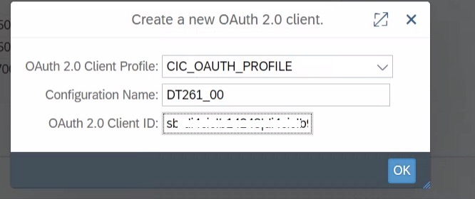

# Create an OAuth Client Profile 
In this exercise, you will create an OAuth Client Profile later used in the connectivity to the APIs of gateway. 
The RFC destination of the next exercise will use the Oauth client for authentication. 

You will need the file from the service binding of [Exercise 1](../ex1/README.md#enable-access-to-data-ingestion-di-for-industry-cloud-solutions-apis).

## Create an OAuth Client Profile

1. Create a new OAuth Client:

   - Log on to your S/4HANA system using your username and password.

      > **Note:** During your TechEd hands-on, you will be provided with a predefined username and password.

   - Call transaction `OA2C_CONFIG`. A browser window will open. Log on with the credentials from the previous step.

      > **Note:** In case of an error like below, copy the url and enter it in a browser.
         

   - Press the ***Create*** button.

      

   - In the *Create* dialog:
      - Select ***`CIC_OAUTH_PROFILE`*** as ***OAuth 2.0 Client Profile***,
      - Enter a name in ***Configuration Name*** (e.g. ***`DT261_<your participant number>`***),

        

      - Enter the `clientID` from the service binding file in ***OAuth 2.0 Client ID***,

          

      - Click the ***OK*** button.

2. Set OAuth Client Profile details:

   - Scroll down and select the ***Administration*** tab in the ***Details*** section.

   - Enter the ***`clientSecret`*** from the service binding file in the ***Client Secret*** field.

   - Enter the ***`url`*** from the service binding file in the ***Authorization Endpoint*** field and append `/oauth/token?grant_type=client_credentials&response_type=token` to it.

   - Enter the ***`url`*** from the service binding file in the ***Token Endpoint*** field and append `/oauth/token?grant_type=client_credentials&response_type=token` to it.

     

   - Select ***Client Credentials*** from the *Selected Grant Type* selector.

    
   
   - Click the ***Save*** button at the top of the screen.

## Next Steps

[//]: # (TODO: Add a description of what happens next)

### Go back to: [**Configure Data Ingestion for Industry Cloud Solutions**](../ex2/README.md) or Continue to: [**Configure the RFC Connection**](../ex5/README.md)
