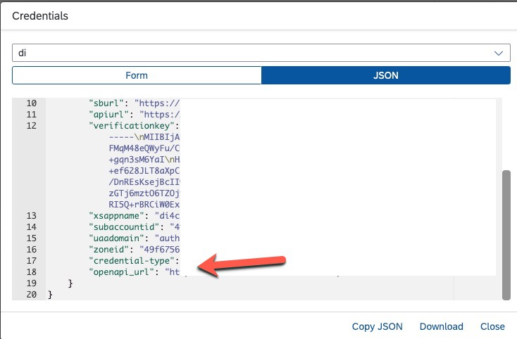
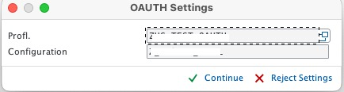
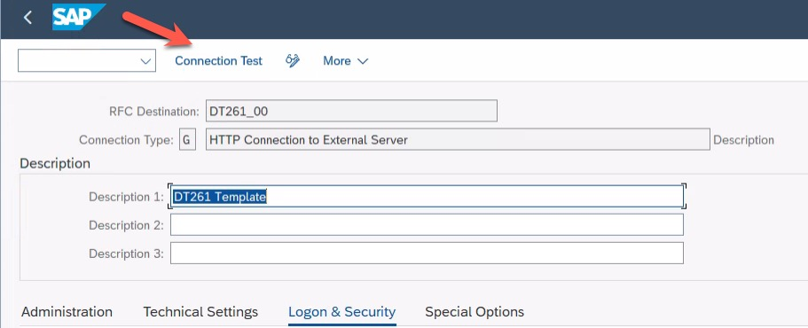

# Configure the RFC Connection

In this exercise, you will configure the connection using the OAuth Client Profile from the previous exercise. 
The RFC connection will be used for the outbound calls to Data Ingestion.

You can use connection `DT261_00` as reference for this exercise.

[//]: # (TODO: Fix this heading)

## Create an RFC Connection

* Call transaction `SM59`

* Press the ***Create*** button

* In the *Create Destination* dialog:
   - Enter a destination name for ***Destination*** (e.g. ***`DT261_<your participant number>`***), 
   - Select ***`G HTTP connection to external server`*** for ***Connection Type***, 
   - Click the green checkmark button (*Continue*).

* In the ***Technical Settings*** tab of the new page:
   - Enter the ***`openapi_url`*** from the service binding file in the ***Host*** field. Remove `https://` from the value. E.g.: For `"openapi_url":"https://api.us.di-ics.services.sap"` the 'Host' will be `api.us.di-ics.services.sap`

      

* In the ***Logon & Security*** tab:
   - Push the ***OAuth Settings*** button, 

[//]: # (TODO: Needs name)
   - Select the Profile and Configuration from exercise 4 CIC_OAUTH_PROFILE and the configuration name from exercise 4, 

      

   - Select the ***Active*** radio button for the ***SSL*** field in the *Status of Secure Protocol* section, 

      

   - Press the ***Save*** button.

   - Run a connection test.

   

  

## Next Steps
In the next step we will configure the Data Replication Framework.
[//]: # (TODO: Add a description of what happens next)

### Go back to: [**Create an OAuth client**](../ex4/README.md) or Continue to: [**Configure the Data Replication Framework - Business System**](../ex6/README.md)
