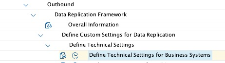

# Configure the Data Replication Framework - Business System
We use Data Replication Framework to read S/4HANA source data, transform it to the Industry Cloud format (One Domain Model) and send the data out to gateway.

You will configure the connection maintained in the previous exercise as Business System for DRF.

## Maintain a Business System for Replication

- Call transaction `DRFIMG`

- Go to *Data Replication* -> *Define Custom Settings for Data Replication* -> *Define Technical Settings* -> *Define Technical Settings for Business Systems*

    

- Click the ***New Entries*** button

- Enter the destination from the previous exercise in the ***RFC Destination*** column (e.g. ***`DT261_<your participant number>`***).

- Enter the name of your destination in the ***Business System*** column.

    

- Click the ***Save*** button - ignore the warning.

   > The warning will state that the selected Business System is not part of the System Landscape Directory (SLO). For the purpose of this exercise the warning can be ignored.

## Next Steps

[//]: # (TODO: Add a description of what happens next)

### Go back to: [**Configure the RFC Connection**](../ex5/README.md) or Continue to: [**Configure the Data Replication Framework - Replication Model**](../ex7/README.md)
