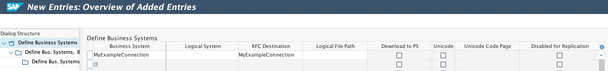
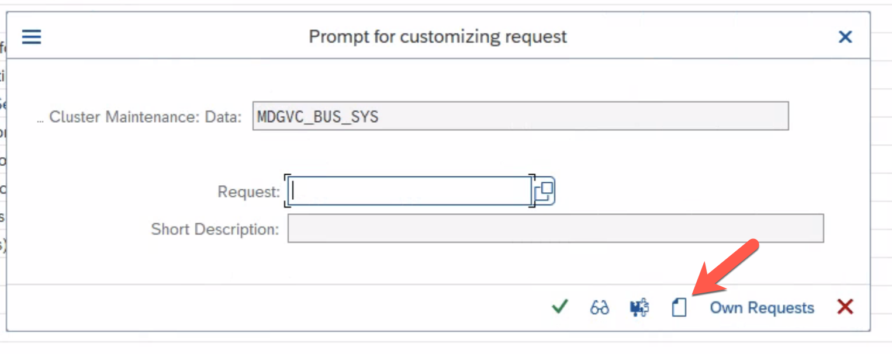

# Configure the Data Replication Framework - Business System
We use Data Replication Framework to read S/4HANA source data, transform it to the Industry Cloud format (One Domain Model) and send the data out to gateway.

You will configure the connection maintained in the previous exercise as Business System for DRF.

> **Warning**
> The content of this exercise is up-to-date as of TechEd 2022. Please go to the official [SAP Data Ingestion for Industry Cloud documentation](https://help.sap.com/docs/DI_ICS/925366f331c54ee88e2b61ddae0be9fc/88da41cc955e49f1b7080e882bae36d4.html?locale=en-US) for the most recent version.

## Maintain a Business System for Replication

- Call transaction `DRFIMG`

- Go to *Data Replication* -> *Define Custom Settings for Data Replication* -> *Define Technical Settings* -> *Define Technical Settings for Business Systems*

    

- Click the ***New Entries*** button

- Enter the destination from the previous exercise in the ***RFC Destination*** column (e.g. ***`DT261_<your participant number>`***).

- Enter the name of your destination in the ***Business System*** column.

    

- Click the ***Save*** button - ignore the warning.

   > The warning will state that the selected Business System is not part of the System Landscape Directory (SLD). For the purpose of this exercise the warning can be ignored.

- Click the ***Create*** button in the *Prompt for customizing request* dialog.

    

- Add a *Short Description* and click the ***Save*** button in the *Create Request* dialog.

    

- Click the ***Save*** (green checkmark) button in the *Prompt for customizing request* dialog.

    

## Next Steps

In the next exercise, you will assign this Business System to a Replication Model.

### Go back to: [**Configure the RFC Connection**](../ex5/README.md) or Continue to: [**Configure the Data Replication Framework - Replication Model**](../ex7/README.md)
