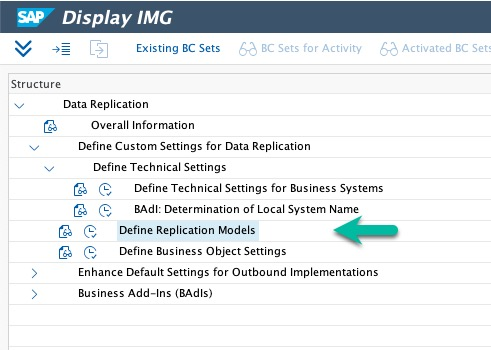
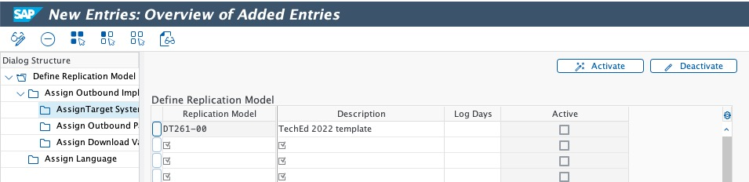
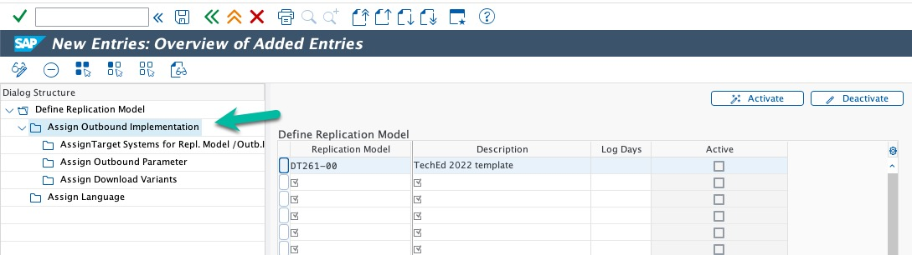
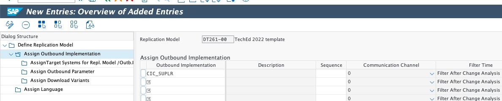
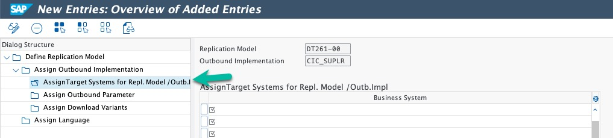
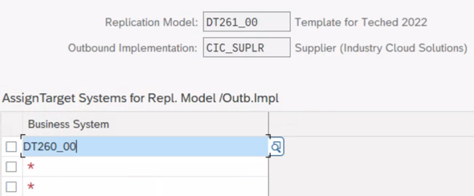
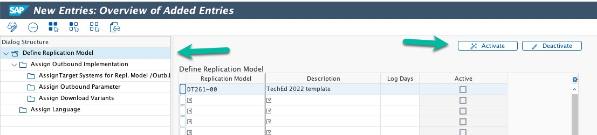

# Configure the Data Replication Framework - Replication Model

In this step we will configure the entities to replicated to Industry Cloud. Depending on the application in scope different entities are required (order sourcing requires different entities than promotion planning). A replication model groups together outbound implementations for the individual entities (product, plant, sales organization etc.). We plan to automate this configuration. In the exercise we will configure it manually.

> **Warning**
> The content of this exercise is up-to-date as of TechEd 2022. Please go to the official [SAP Data Ingestion for Industry Cloud documentation](https://help.sap.com/docs/DI_ICS/925366f331c54ee88e2b61ddae0be9fc/88da41cc955e49f1b7080e882bae36d4.html?locale=en-US) for the most recent version.

## Maintain a Replication Model

1. Call transaction `DRFIMG`

2. Go to Define Custom Settings for *Data Replication&* -> *Define Technical Settings* -> *Define Replication Models*

    

3. Click ***New Entries***. Create a *Replication Model* called `DT261_<group number>`. Add a short text as *Description*.

   

   > **Note**
   > During your TechEd Hands-On, you can use replication model `DT261_00` as a template.

4. Select the Replication Model via its checkbox and double-click on *Assign Outbound Implementation*
   
   

5. Click ***New Entries***. Add ***`CIC_SUPLR`*** (for Supplier) as *Outbound Implementation*.

   

6. Select the Outbound Implementation (e.g. ***`CIC_SUPLR`***) via its checkbox and double-click on ***Assign Target Systems for Repl. Model/Outb. Impl***.

   

7. Click ***New Entries***. Assign the *Business System* defined in exercise 6 to the Outbound Implementation.

   

8. Repeat steps 4 to 7 for each of the Outbound Implementations below. Don't forget to assign a target system to each outbound implementation (step 6 & 7). 

| **Outbound Implementation** |
|-----------------------------|
| CIC_COSD                    |
| CIC_COUNTR                  |
| CIC_CUST                    |
| CIC_SUPLR                   |
| CIC_FCAL                    |
| CIC_FCALD                   |  
| CIC_CHTC                    |   	
| CIC_DIV                     |   	
| CIC_CUSTOD                  |  
| CIC_PRDPLT                  | 
| CIC_TEMPB                   |   
| CIC_LOADGP                  | 
| CIC_SOS                     |   	
| CIC_TRANS                   |   	
| CIC_UOM                     |   
| CIC_SLSORG                  | 
| CIC_PROD                    | 
| CIC_HOLIDY                  |
| CIC_CURC                    |
| CIC_DIST                    |
| CIC_LANG                    |
| CIC_PLANT                   |
| CIC_MCH                     |
| CIC_PROD                    |

9. Click ***Save***.

10. Return to the Replication Model overview, select your Replication Model and press ***Activate***.

     

## Next Steps

In the next exercise, you will use these replication models and run them.

### Go back to: [**Configure the Data Replication Framework - Business System**](../ex6/README.md) or Continue to: [**Run Replication for configured entities**](../ex8/README.md)
