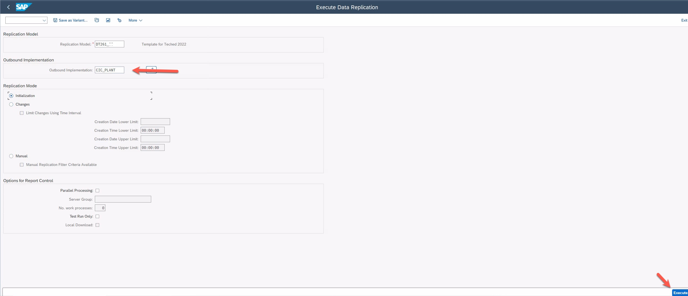

# Run Replication for Configured Entities
After the configuration of the Replication Model you will now start replication of data. This is typically performed through a periodic job. For this exercise we will manually trigger replication.
You will use the Replication Model configured in exercise 7. 

## Run Replication 

1. Call transaction `DRFOUT`.

2. Enter the Replication Model you maintained in exercise 7. It should be `DT261_<group number>`.

3. Select *Outbound Implementation* ***`CIC_PLANT`***.

4. Select ***Initialization*** in section Replication Mode. Avoid running DRFOUT in initial mode setting for larger entities (like product) to avoid longer wait times

   

8. Execute `DRFOUT` by pressing `F8`  or clicking `Execute`.

## Next Steps

In the next step we will navigate to Order and Delivery Schedule to see plant data that we replicated in this exercise.

### Go back to: [**Configure the Data Replication Framework - Replication Model**](../ex7/README.md) or Continue to: [**Display Data in SAP Order and Delivery Scheduling solution**](../ex3/README.md)
