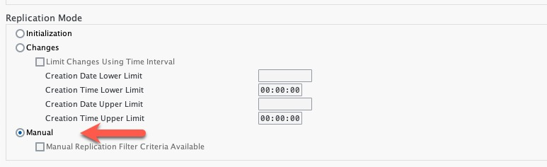

# Run Replication for Configured Entities
After the configuration of the Replication Model you will now start replication of data. This is typically performed through a periodic job. For this exercise we will manually trigger replication.
You will use the Replication Model configured in exercise 7. 

## Run Replication 
1. Call transaction `DRFOUT`.

2. Enter the Replication Model you maintained in exercise 7.

3. Select 'Outbound Implementation' CIC_SUPLR

4. Select 'Manual' in section Replication Mode. Avoid running DRFOUT in initial mode setting to avoid longer wait times

   

5. Click on 'Manual Replication Filter Criteria'

    

6. Enter Supplier to <todo add sample data>

7. Press the ***Save*** button.

8. Execute `DRFOUT` by pressing `F8`.

## Next Steps

[//]: # (TODO: Add a description of what happens next)

### Go back to: [**Configure the Data Replication Framework - Replication Model**](../ex7/README.md) or Continue to: [**Enable SAP Order and Delivery Scheduling solution**](../ex3/README.md)
