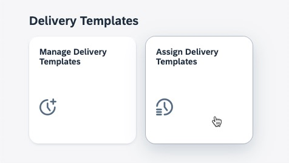
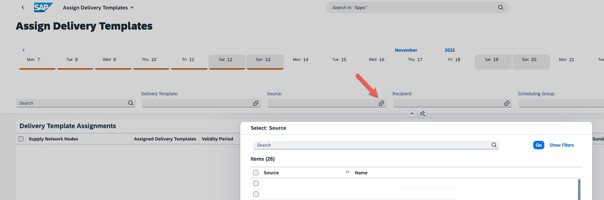

# Run ODS demo scenario

> **Warning**
> The content of this exercise is up-to-date as of TechEd 2022. Please go to the official [SAP Order and Delivery Scheduling documentation](https://help.sap.com/docs/ORDER_DELIVERY_SCHEDULE_OD/7ddeeefdcf4b4ae0ad42a5990a781c9e/4d2d354732b94364823e14fdb2d10e02.html?locale=en-US) for the most recent version.

Go to the Order Delivery Schedule (ODS) application and select tile *Assign Delivery Templates*.

   

1. Select the value help for ***Source***.
   
2. Find the data that has been replicated from S/4HANA in the previous exercise.

   