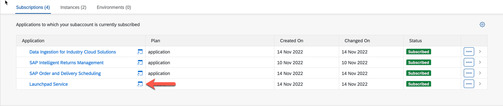
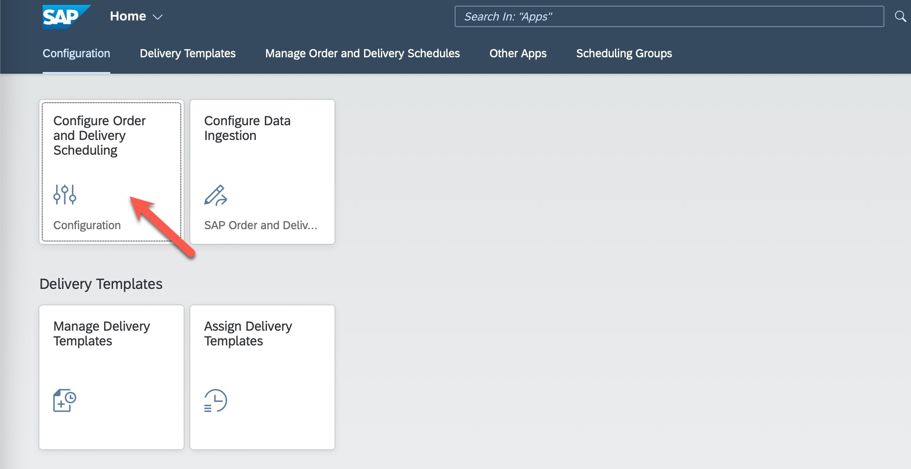

# Run ODS demo scenario

> **Warning**
> The content of this exercise is up-to-date as of the SAP TechEd Hands-On Lab 2022. Please go to the official [SAP Order and Delivery Scheduling documentation](https://help.sap.com/docs/ORDER_DELIVERY_SCHEDULE_OD/7ddeeefdcf4b4ae0ad42a5990a781c9e/4d2d354732b94364823e14fdb2d10e02.html?locale=en-US) for the most recent version.

1. Configure Order and Delivery Schedule

   - Open the Launchpad Service.
      
      

   - Click on the *Configure Order and Delivery Scheduling* tile.

      

   - Select a *First Day of the Week* and click ***Apply***.

      

2. See Data in Order and Delivery Scheduling

   - Go back to the Launchpad. Click the *Assign Delivery Templates* tile.

      

   - Select the value help for ***Source***.
   
   - Find the data that has been replicated from S/4HANA in the previous exercise.

      
